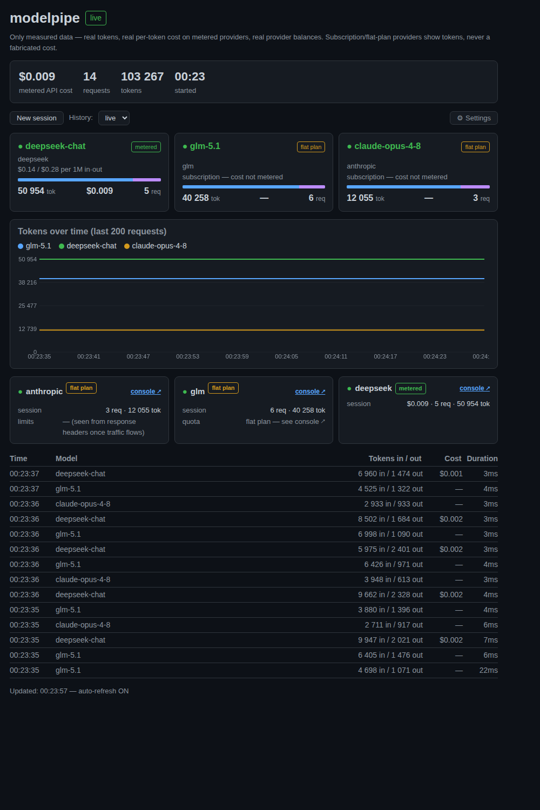

# Dashboard

With `"dashboard": true`, modelpipe serves a live monitoring page at
`http://127.0.0.1:8787/dashboard` (served from the proxy process, no install).

## Honesty rule

The dashboard shows only **measured** data. Money appears **only where it is real**: a
per-token cost for `metered` (pay-as-you-go) providers and real provider balances. For
`subscription` (flat-plan) providers — a GLM Coding Plan, an Anthropic subscription — per-token
dollars are meaningless, so it shows **tokens + a "flat plan" label**, never a fabricated cost.
No invented quota bars, no subscription-cost proration, no "plan vs API saves $X" verdicts.

The `billing` mode is derived per route (passthrough & z.ai/GLM ⇒ subscription, other key-swap
⇒ metered) and can be overridden per provider in **Settings → Billing** (or `POST /v1/billing`).

## What it shows

- **Session bar** — metered API cost (subscription providers contribute nothing), requests,
  tokens, start time.
- **Model cards** — provider, a `metered`/`flat plan` tag, tokens, requests; `$` only for
  metered models (flat-plan shows `—`).
- **Token chart** — cumulative tokens per model over the last 200 requests.
- **Provider cards** — real data only: DeepSeek balance, OpenRouter credits, Anthropic
  RPM/ITPM/OTPM (from live response headers), per-provider session totals, and a **console ↗**
  link to each provider.
- **Request log** — last 50 requests: time, client (who — user-agent·auth-fingerprint), the
  routing trace (sent alias → routed model `[provider]` → what the provider echoed back), tokens
  in/out, cost, duration. An error row carries the same trace plus a short human-readable reason
  extracted from the backend's own error body.
- **Sessions** — "New session" archives + starts fresh; history dropdown holds the last 20.
- **Settings (⚙)** — profiles & switching rules (including same-target retry — see
  [profiles.md](profiles.md#config)), metered token prices, context fitting (compact),
  concurrency limits (including the live self-throttled ceiling — see
  [failover.md](failover.md#concurrency-limiting)), account-pool state, and the billing override.

## Persistence

The live session (per-model/provider totals + timeline) is flushed to `~/.modelpipe/state.json`
every 10 s and on shutdown, and **resumed on startup** — a crash loses at most a few seconds.
Archived sessions live in `~/.modelpipe/sessions.json`; dashboard-set token prices / failover
pairs / billing overrides in `~/.modelpipe/overrides.json`. The config file stays the immutable
source of truth; overrides merge on top. (Override the base dir with `MODELPIPE_DIR`.)

## Pricing catalog

Built-in metered prices for `claude-*`, `deepseek-*`, `glm-*`, and `google/gemini-*` in
`src/stats.mjs` (`PRICE_MAP`). Unknown models show `price —` and $0 (they still count tokens).
Override per-model at runtime via Settings (⚙) or `config.tokenPrices`.

## API endpoints (only when `dashboard: true`)

| Endpoint | Returns / does |
| --- | --- |
| `GET /v1/version` | The running build's version: `{version}`. **Always available — not gated on `dashboard`** — so you can confirm which build is actually live (a deployed artifact vs a stale process). Shown in the dashboard's header badge. |
| `GET /v1/stats` | Per-model usage, session totals, timeline. |
| `GET /v1/quotas` | Real provider balances (DeepSeek, OpenRouter). |
| `GET /v1/sessions` | Archived session history (up to 20). |
| `GET /v1/models` | Secret-free route listing (globs, hosts, auth mode, vision + billing). |
| `GET /v1/profiles` | Profile definitions, `auto` chain, live state (pinned/offset), routing summary — see [profiles.md](profiles.md). |
| `GET /v1/compact` | Live, normalized context-compaction config — see [compaction.md](compaction.md). |
| `GET /v1/concurrency` | Configured per-model limits + live queue state (`active`, `limit`, `effLimit`, `queued`) — see [failover.md#concurrency-limiting](failover.md#concurrency-limiting). |
| `GET /v1/accounts` | Account-pool state: labels, strategy, per-account cooldown. |
| `POST /v1/sessions/reset` | Archive the current session, start a new one. |
| `POST /v1/token-prices` | Update metered token prices (persisted). |
| `POST /v1/billing` | Override a provider's billing mode: `{provider, mode: metered\|subscription\|auto}`. |
| `POST /v1/profiles/config` | Replace the profile definitions + switching rules (`profiles`, `auto`, `defaultProfile`), persisted. |
| `POST /v1/profiles/pin` | Set (`{profile: "name"}`) or clear (`{profile: null}`) the manual pin. |
| `POST /v1/profiles/reset` | Clear the pin and any active error-shift — back to the default head. |
| `POST /v1/compact` | Replace the compaction config, persisted. |
| `POST /v1/concurrency` | Replace the per-model concurrency limits (and optionally `queueTimeoutMs`), persisted. |
| `POST /v1/accounts/reset` | Clear account cooldowns (`?label=X` for one). |

All endpoints are JSON, secret-free (no keys, no env-var names), served only on localhost.
